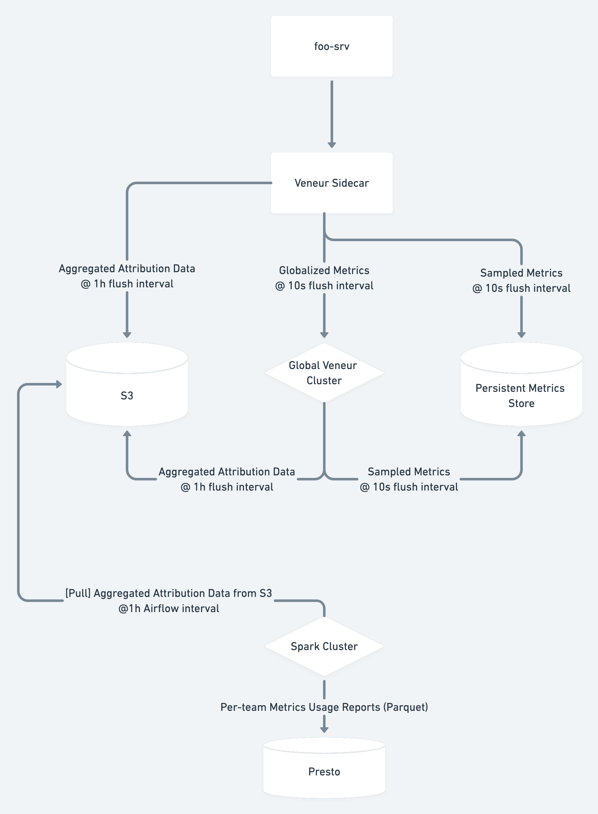

# Attribution

`attribution` is a sink used to profile the makeup of metrics processed by Veneur. This includes qualitative information such as what service (application) owners emit metrics as well as quantitative (the cardinality of metric namespaces/tags, the rate at which datapoints are flushed from sinks).

Using the attribution sink will likely look something like this for your organization:



Although this diagram makes reference to a Veneur > Spark > Presto pipeline, Spark and Presto are provided as examples of what one could do with data flushed from the attribution sink. There is no code in this PR to set up such a pipeline.

## Development Status

This sink is experimental and makes opinionated assumptions about your organization that may not apply to all organizations.

- Your organization does not care about attributing metrics in real time, and is willing to use the experimental Metrics Sink Routing feature to tally and compute attribution metrics out of band from metrics being forwarded to their final destination
- Your organization does not care about attributing spans
- Your organization uses AWS S3

This sink is experimental; use with caution and be mindful of non-backwards-compatible changes that may occur even with a Veneur major version bump.

## Usage

```yaml
metric_sinks:
  - kind: attribution
    name: attribution
    config:
      veneur_instance_id: workerbox-1234.northwest.qa.paymentscompany.com
      aws_region: us-west-2
      s3_bucket: veneur-attribution
      schema_version: 1
```

There are four required config options:

- `veneur_instance_id`: An arbitrary identifier used in the S3 key path to identify the Veneur sidecar that the attribution sink is monitoring the flushes of. This cannot be automatically generated by Veneur because Veneur does not know what is supervising it, or how many Veneur instances are running per host/pod. Example IDs: hostname, pod ID, UUID, etc.
- `aws_region`: AWS region to write attribution data to
- `s3_bucket`: S3 bucket to write attribution data to
- `schema_version`: A version number, documented below, specifying the contents and ordering of the output TSV written to S3

### Schema Versions

- `1`: 1 row per metric name. Specifies metric name, owner (if applicable), and cardinality (number of unique timeseries processed associated with a metric name in a given worker interval). Best used in cases where all timeseries emitted from the Veneur instance are globally unique, i.e. no two Veneurs running in a fleet, as it can be assumed the cardinality reported in the TSV is a faithful representation of the actual cardinality for a given metric name.
- `2`: 1 row per metric timeseries. Specifies metric name, owner (if applicable), and a digest of the metric timeseries. Best used in cases where more than one Veneur instance in a fleet of Veneurs can emit the same metric timeseries, thus further aggregation needs to be down downstream of this sink to determine the global cardinality of a given metric name.
