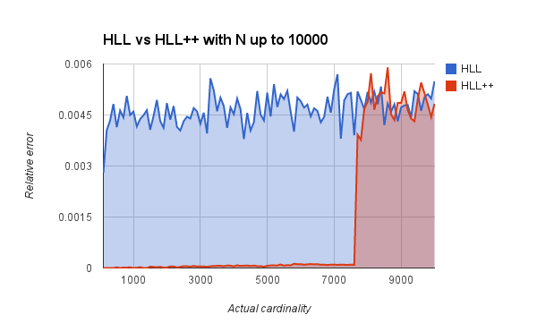
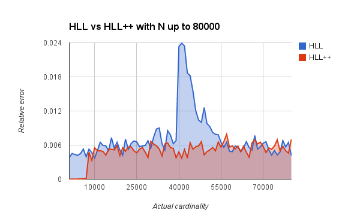

  
# HyperLogLog and HyperLogLog++
Implements the HyperLogLog and HyperLogLog++ algorithms.

HyperLogLog paper: http://algo.inria.fr/flajolet/Publications/FlFuGaMe07.pdf

HyperLogLog++ paper: http://research.google.com/pubs/pub40671.html

## Documentation
Documentation can be found [here](http://godoc.org/github.com/clarkduvall/hyperloglog).

## Comparison of Algorithms
The HyperLogLog++ algorithm has much lower error for small cardinalities. This
is because it uses a different representation of data for small sets of data.
Data generated using this library shows the difference for N < 10000:

HyperLogLog++ also has bias correction which helps offset estimation errors in
the original HyperLogLog algorithm. This correction can be seen here, again
using data generated using this library:

## Future Improvements
- Right now HLL++ uses 8 bits per register. It could use 6 bits and take less
  memory.
- The list compression algorithm could be improved, allowing the sparse
  representation to be used longer.
